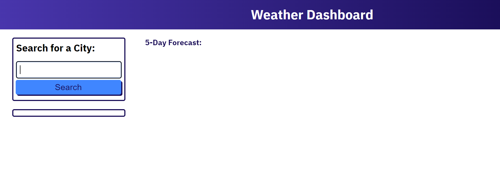

# Weather-Dashboard

## Description

A simple app for checking the weather forecast.

## Installation

N/A

## Usage

To get the forecast for a city, open ([Weather Dashboard](https://lexigeller.github.io/Weather-Dashboard/)) in a browser. Click the text box and type in a city name, then press the search button. A five-day forecast that includes temperature, humidity, and wind speed will be shown, and the city search will be added to a list on the lefthand side of the screen. To revisit any of the previously searched cities, simply click on the city's name in the list of past searches and the forecast will be displayed again.

## Credits

N/A

## License

Please refer to the LICENSE in the repo.
